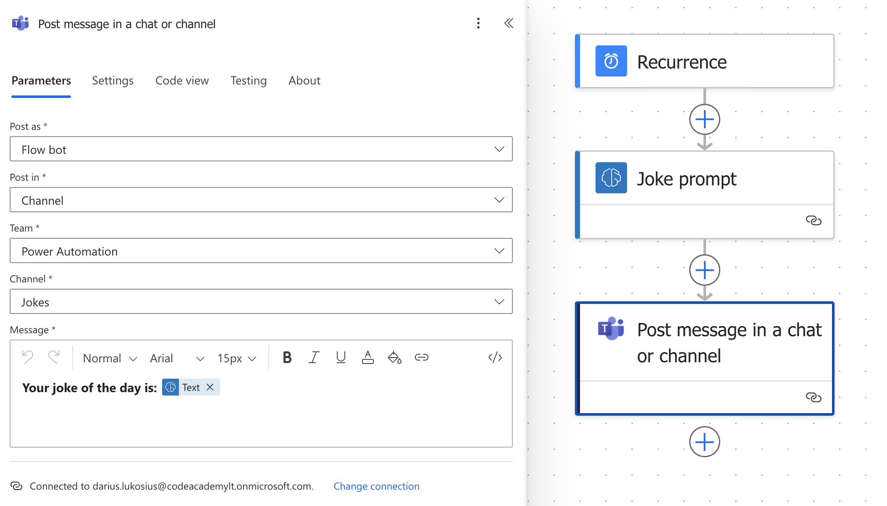
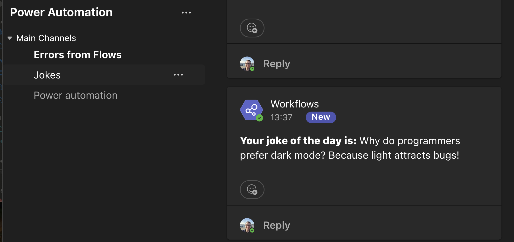

# 🤖 Power Automate AI Jokes Bot

Šis **Power Automate flow** kasdien 09:30 Lietuvos laiku siunčia trumpą **IT juokelį** į Microsoft Teams kanalą 🎉

---

## 📸 Flow schema

## 📩 Pavyzdinė Teams žinutė

---

## ⚙️ Flow struktūra
1. **Trigger:** Recurrence (kasdien 09:30 LT laiku)  
2. **Action 1:** AI prompt – sugeneruoja IT juokelį  
3. **Action 2:** Post message in Microsoft Teams channel  

---

## 🚀 Kaip naudoti
1. Importuok šį flow į savo Power Automate.  
2. Pakeisk Teams kanalą į savo tikslinį kanalą.  
3. Pasirink pageidaujamą laiką (pvz., 09:30).  

---

## 💡 Pastabos
- Flow veikia automatiškai, todėl nereikia rankinio įjungimo.  
- Nuotraukos (`flow.png` ir `teams.png`) parodytos, kaip atrodo flow dizainas ir gauta Teams žinutė.

---

**Autorius:** Darius Lukosius
